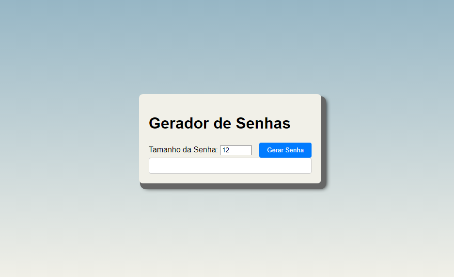

# Password-Generator

  

A password generator coded in Html Css e JavaScript. // Um gerador de  senhas feito em Html Css e JavaScript.

## 🔨 Funcionalidades // Functionalities

- `Functionalities 1` : Generate passwords of up to 50 characters // Gerador de senha de até 50 caractéres.

- `Functionalities 2` : Totally random characters. // Caractéres totalmente aleatórios.

- `Functionalities 3` : You have the option to choose the amount of characters you want. // Você tem a opção de escolher a quantidade de caracteres desejáveis.

## ⚒️ Como usar? // How to use? ⚒️

- `Acess link // Acesse o link`: https://password-generator-six-tan.vercel.app/
- `Very intuitive, just select the number of characters and generate // Muito intuitivo, basta selecionar a quantidade de caractéres e gerar.`

# Developer
 [ Thales Eduardo Pedro](https://github.com/thales32k0)
 
